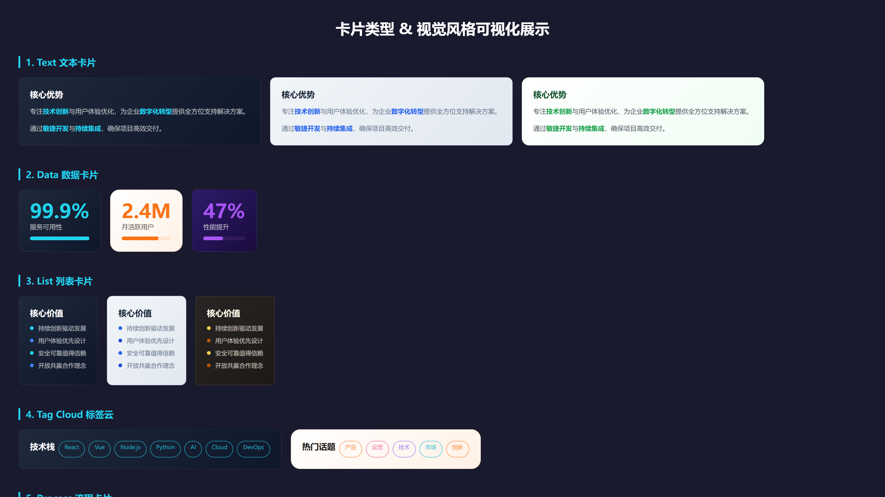
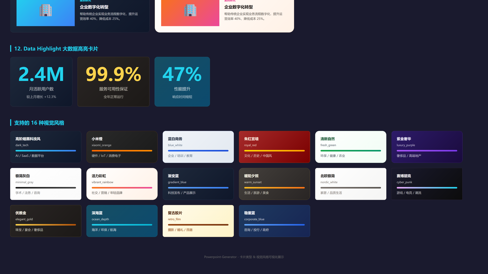

# Powerpoint-Generator

> A high-quality PPT generation tool inspired by Kimi PPT Agent, outputting professional-grade HTML presentations + editable vector PPTX files.

**[English](README.md)** | [中文](README_CN.md) | [MIT License](LICENSE)

---

## Workflow Overview

```
Requirements Interview → Research → Outline → Planning Draft → Style + Images + HTML Design → Post-processing (SVG + PPTX)
```

---

## Features

### Supported Card Types

The project supports 12 professional card types for various presentation scenarios:

| Card Type | Description |
|-----------|-------------|
| **text** | Text content card |
| **data** | Data display card |
| **list** | List card |
| **tag_cloud** | Tag cloud |
| **process** | Process card |
| **timeline** | Timeline card |
| **comparison** | Comparison card |
| **quote** | Quote card |
| **stat_block** | Statistics block card |
| **feature_grid** | Feature grid card |
| **image_text** | Image text overlay card |
| **data_highlight** | Big data highlight |

### Supported Visual Styles

The project includes 16 professional design styles:

| Style ID | Style Name | Use Case |
|---------|-----------|----------|
| `dark_tech` | Premium Dark Tech | AI / SaaS / Data Platform |
| `xiaomi_orange` | Xiaomi Orange | Hardware / IoT |
| `blue_white` | Blue White Business | Enterprise / Training / Education |
| `royal_red` | Royal Red | Culture / History / Chinese Style |
| `fresh_green` | Fresh Green | Environmental / Health / Agriculture |
| `luxury_purple` | Luxury Purple | Luxury / High-end Real Estate |
| `minimal_gray` | Minimal Gray | Academic / Legal / Consulting |
| `vibrant_rainbow` | Vibrant Rainbow | Social / Marketing / Young Brands |
| `gradient_blue` | Gradient Blue | Tech Launch / Product |
| `warm_sunset` | Warm Sunset | Lifestyle / Travel |
| `nordic_white` | Nordic White | Home / Quality Life |
| `cyber_punk` | Cyber Punk | Gaming / E-sports / Trendy |
| `elegant_gold` | Elegant Gold | Jewelry / Banquet / Luxury |
| `ocean_depth` | Ocean Depth | Marine / Environmental / Navigation |
| `retro_film` | Retro Film | Photography / Wedding / Homestay |
| `corporate_blue` | Corporate Blue | Consulting / Investment / Government |






---

## Demo Showcase

> Example output for "New Xiaomi SU7 Launch" theme (Xiaomi Orange style):

| Cover | Configuration Comparison |
|:---:|:---:|
|  |  |

| Power & Range | Smart Driving & Safety |
|:---:|:---:|
|  |  |

| End Page |
|:---:|
|  |

---

## Key Features

| Feature | Description |
|---------|-------------|
| **6-Step Pipeline** | Requirements → Research → Outline → Planning → Design → Post-processing, simulating professional PPT company workflow |
| **16 Preset Styles** | Dark Tech / Xiaomi Orange / Blue White / Royal Red / Fresh Green / Luxury Purple / Minimal Gray / Vibrant Rainbow / Gradient Blue / Warm Sunset / Nordic White / Cyber Punk / Elegant Gold / Ocean Depth / Retro Film / Corporate Blue |
| **12 Card Types** | text / data / list / tag_cloud / process / timeline / comparison / quote / stat_block / feature_grid / image_text / data_highlight |
| **7 Bento Layouts** | Single Focus / 50/50 Symmetric / Asymmetric Two-column / Three-column Equal Width / Primary-Secondary / Hero with Sub-items / Mixed Grid |
| **Smart Illustrations** | Unsplash image library + 5 visual fusion techniques (fade blend / tinted overlay / ambient background / etc.) |
| **Typography System** | 7-level font scale + spacing hierarchy + CJK mixed typesetting rules |
| **Color Proportion** | 60-30-10 rule + accent color usage constraints |
| **Data Visualization** | 8 pure CSS/SVG chart types (progress bars / ring charts / sparklines / waffle charts / KPI cards / etc.) |
| **Cross-page Narrative** | Density alternation / chapter color progression / cover-ending visual echo / progressive reveal |
| **Footer System** | Unified footer with chapter info + page numbers, cross-page navigation |
| **PPTX Compatible** | HTML → SVG → PPTX pipeline, right-click "Convert to Shape" in PPT 365 for full editing |

---

## Output

| File | Description |
|------|-------------|
| `preview.html` | Browser-based paginated preview (auto-generated) |
| `presentation.pptx` | PPTX file, right-click "Convert to Shape" in Office 365 for editing |
| `svg/*.svg` | Per-page vector SVG, drag into PPT directly |
| `slides/*.html` | Per-page HTML source files |

---

## Requirements

**Required:**
- **Node.js** >= 18 (Puppeteer + dom-to-svg)
- **Python** >= 3.8
- **python-pptx** (PPTX generation)

**Optional (for illustrations):**
- **Unsplash API Key**: Apply at [Unsplash Developers](https://unsplash.com/developers)

**Quick Install:**
```bash
pip install python-pptx lxml Pillow
npm install puppeteer dom-to-svg
```

---

## Illustration Configuration (Optional)

The project supports Unsplash free image library as an illustration source. Configuration steps:

1. Apply for API Key: [Unsplash Developers](https://unsplash.com/developers) → New Application → Get Access Key

2. Configure environment variables:
   ```bash
   # Copy template file
   copy .env.example .env
   
   # Edit .env, fill in your Access Key
   UNSPLASH_ACCESS_KEY=your_Access_Key
   ```

3. When using `.env` file, the API Key will not be committed to the Git repository (`.gitignore` is configured)

> Configuration is optional. If not configured, the Agent will use text/data-driven design approach.

---

## Directory Structure

```
Powerpoint-Generator/
  SKILL.md                    # Main workflow instructions (Agent entry point)
  README.md                   # This file (English)
  README_CN.md               # Chinese documentation
  .env.example                # Environment variable template (Unsplash API Key)
  references/
    prompts.md                # 5 Prompt templates
    style-system.md           # 16 preset styles + CSS variables
    bento-grid.md             # 7 layout specs + 12 card types
    card-demo.html            # Card types & style visual demo
    method.md                  # Core methodology
  scripts/
    html_packager.py          # Merge multi-page HTML into paginated preview
    html2svg.py               # HTML → SVG (dom-to-svg, preserves editable text)
    svg2pptx.py               # SVG → PPTX (OOXML native SVG embedding)
```

---

## Usage

Just describe your needs in the conversation to trigger the skill. The Agent will automatically execute the full 6-step workflow:

```
You: "Make a PPT about X"
  → Agent interviews you for requirements (waits for your reply)
  → Auto research → outline → planning draft → per-page HTML design
  → Auto post-processing: HTML → SVG → PPTX
  → All outputs saved to ppt-output/
```

**Trigger Examples:**

| Scenario | What to Say |
|----------|-------------|
| Topic only | "Make a PPT about X" / "Create a presentation on Y" |
| With source material | "Turn this document into slides" / "Make a PPT from this report" |
| With requirements | "15-page dark tech style AI safety presentation" |
| Implicit trigger | "I need to present to my boss about Y" / "Make training materials" / "Make a roadshow deck" |

> No manual script execution needed. All post-processing (preview merge, SVG conversion, PPTX generation) is handled automatically by the Agent in Step 6.

---

## Acknowledgments

This project is based on [ppt-agent-skill](https://github.com/Akxan/ppt-agent-skill). We thank the original project author for their excellent work and open source spirit.
